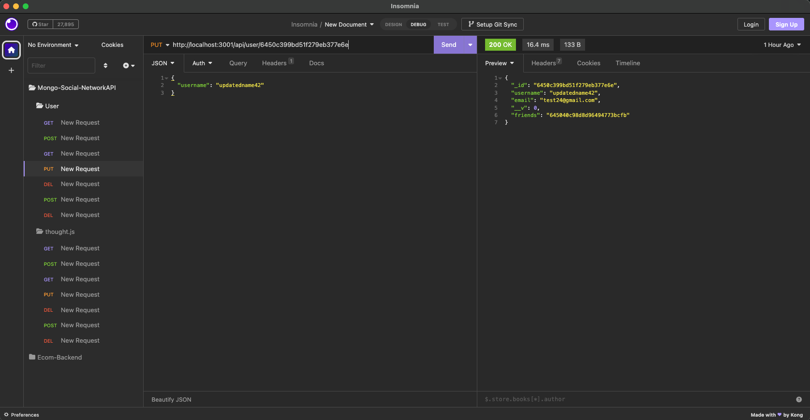

  # Social-Network-API

  ## Description
  
  Social network Backend that utilizes tech like MongoDB, Mongoose ORM and Express.js to CRUD and define relationships between collections stored in the mongodb and then served by a Express.js server.

  ## Table of contents
  
  - [ Link ](#link)
  - [ Screenshot ](#screenshot)
  - [ Installation ](#installation)
  - [ Usage ](#usage)
  - [ Contributions ](#contributions)
  - [ Tests ](#tests)
  - [ Questions ](#questions)
  - [ License ](#license)
  

  ## Link
  
  [Click Here](not/yet) to go to the video link.
  

  ## Screenshot
  
  
  

  
  ## Installation
  
  To install simply fork the repo, and clone down to your local machine. Then in the CLI at relative dir run 'npm i' to get all dependancies required for sucessfull run of the package. Download MongoDB and MongoDB-Compass. Finally run 'npm run seed' to create database and collection full of seed data.

  
  ## Usage
  
  To use the package run 'npm start' which will sync the db and start the server.
  
  
  ## Contributions
  
  How to contribute?: 
  fork the repo and clone down to your local machine. Once you have the latest version of the repo you can add or make changes then submit a pull request for your changes. Please use best practices as well as proper naming conventions and comments depicting what the code segements function is. Finally in the body of your pull request please explain why these changes you were necissary and if it is a bug what steps can be completed to reproduce this bug. If these guidelines are not met, pull requests will not be reviewed or accepted.
  

  
  ## Tests
  
  Endpoints were tested with Insomnia, If you should find any issues, see above on contibuting guidlines, or submit a issue with a detailed explanation on how to recreate the bug.
  

  
  ## Questions
  
  Github - Mick L. - https://github.com/micklitodev

  Email - micklito.dev@gmail.com

  When contact me please be mindful of timezones, Please check my profile for my
  current time information. Also, if it pertains to a bug, Please, use a clear,
  legible, instructions on how to recreate this bug as well as any videos or 
  screenshots will be appriciated. Please also make the subject the specified project
  name with a short description of what the contact pertains to. Thank you! 

  
  ## License
  
  MIT  

   To see full details visit https://opensource.org/license/mit/

   Preview... 

   
      Permission is hereby granted, free of charge, to any person obtaining a copy of this software and associated documentation files (the “Software”), to deal in the Software without restriction, including without limitation the rights to use, copy, modify, merge, publish, distribute, sublicense, and/or sell copies of the Software, and to permit persons to whom the Software is furnished to do so, subject to the following conditions:
      
      The above copyright notice and this permission notice shall be included in all copies or substantial portions of the Software.
      
      THE SOFTWARE IS PROVIDED “AS IS”, WITHOUT WARRANTY OF ANY KIND, EXPRESS OR IMPLIED, INCLUDING BUT NOT LIMITED TO THE WARRANTIES OF MERCHANTABILITY, FITNESS FOR A PARTICULAR PURPOSE AND NONINFRINGEMENT. IN NO EVENT SHALL THE AUTHORS OR COPYRIGHT HOLDERS BE LIABLE FOR ANY CLAIM, DAMAGES OR OTHER LIABILITY, WHETHER IN AN ACTION OF CONTRACT, TORT OR OTHERWISE, ARISING FROM, OUT OF OR IN CONNECTION WITH THE SOFTWARE OR THE USE OR OTHER DEALINGS IN THE SOFTWARE.
  
  
  
  